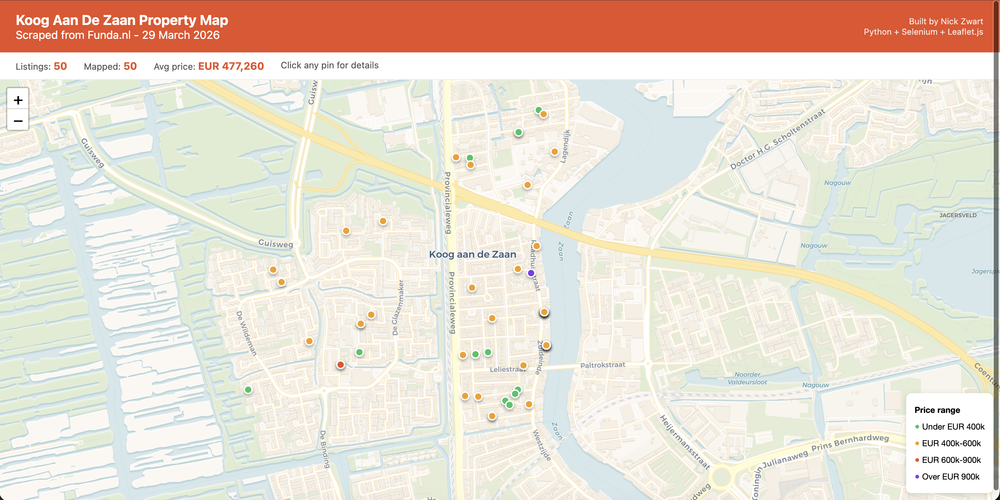

# Funda Property Scraper

A Python + Selenium scraper for [Funda.nl](https://www.funda.nl) — the largest Dutch property platform. Extracts all available listings from any Dutch city and outputs a structured Excel file plus an interactive Leaflet map.



---

## Features

- Works for **any Dutch city** — prompts at startup, no code changes needed
- Bypasses Funda's bot detection using Selenium with stealth settings
- Captures all listing types including **blikvanger** (featured) cards
- Filters out duplicate listings automatically
- Skips sold/unavailable properties
- **Geocodes** every listing by postcode using the free Nominatim API
- Outputs:
  - `funda_{city}.xlsx` — structured spreadsheet with all listing data
  - `funda_{city}.html` — interactive colour-coded Leaflet map (no API key needed)

---

## Output Columns

| Column | Description |
|---|---|
| Address | Street name and number |
| Postcode | Dutch postcode (e.g. 1234 AB) |
| City | City name |
| Price | Asking price in EUR |
| Size_m2 | Living area in m² |
| Rooms | Number of rooms |
| URL | Direct link to the Funda listing |
| Lat / Lon | Geocoded coordinates |

---

## Requirements

```bash
pip install selenium webdriver-manager beautifulsoup4 lxml openpyxl requests tqdm
```

Chrome must be installed. The script auto-downloads the matching ChromeDriver via `webdriver-manager`.

---

## Usage

```bash
python3 funda_scraper.py
```

You will be prompted:

```
=======================================================
  Funda Property Scraper
=======================================================

Which city do you want to scrape? (e.g. amsterdam, rotterdam, utrecht):
```

Type any Dutch city and press Enter. A Chrome window opens automatically — this is normal. The scraper scrolls through all pages, geocodes results, and saves outputs to the current directory.

---

## Example Output

**Koog aan de Zaan** (49 listings):

```
[Koog Aan De Zaan] Fetching page 1...
  Boschjesstraat 69   | EUR 375000 | 100m2 | 1541 KG
  Rozenstraat 48      | EUR 425000 |  72m2 | 1541 DP
  Parallelweg 44      | EUR 475000 | 140m2 | 1541 BB
  ...
Page 4: is a duplicate of previous results - stopping.
Geocoded 49/49.

DONE
  Excel : funda_koog-aan-de-zaan.xlsx
  Map   : funda_koog-aan-de-zaan.html  <- open in browser!
```

---

## Map Preview

The HTML map output uses CartoDB tiles (works when opened locally), colour-codes pins by price range, and shows a popup with address, price, size and a direct Funda link on click.

---

## Notes

- Funda's Terms of Service prohibit automated scraping. This project is for **educational and portfolio purposes only**.
- Geocoding uses the [Nominatim](https://nominatim.org/) API (OpenStreetMap). A 1-second delay is applied between requests to respect their usage policy.
- The scraper detects when Funda starts returning duplicate pages and stops automatically.

---

## Tech Stack

- **Python 3.10+**
- **Selenium** — browser automation + bot detection bypass
- **BeautifulSoup4 / lxml** — HTML parsing
- **Nominatim API** — free postcode geocoding
- **Leaflet.js** — interactive map rendered in HTML
- **openpyxl** — Excel output

---

*Built by Nick Zwart · [GitHub](https://github.com/NickZward)*
